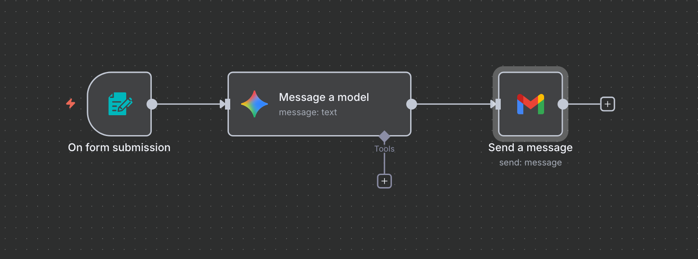
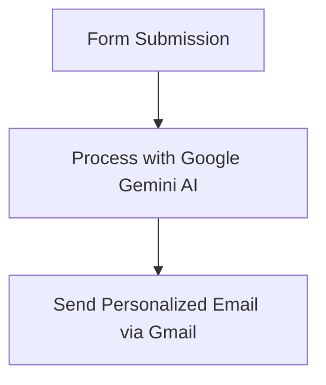

# AI-Powered Email Auto-Responder Workflow with N8N and Google Gemini

-----



## Project Overview

This repository showcases a practical **AI agent workflow** built with **N8N** that automates personalized email responses to form submissions. This project demonstrates how to seamlessly integrate a form trigger, a powerful AI model (Google Gemini), and an email service (Gmail) to create an intelligent, hands-free communication system.

My goal with this project was to explore the fascinating potential of AI agents by building a real-world application. It highlights how accessible and impactful **workflow automation** can be, even for complex tasks involving AI.

-----

## Features

  * **Automated Form Processing**: Instantly captures data from new form submissions.
  * **AI-Powered Response Generation**: Utilizes Google Gemini to analyze user queries and craft suitable, concise email replies.
  * **Personalized Email Delivery**: Sends the AI-generated response directly to the user who submitted the form via Gmail.
  * **Scalable & Always-On (with specific deployment)**: Designed to run continuously and handle incoming requests efficiently.

-----

## Workflow Diagram

The core logic of this project is encapsulated in the following sequence:



-----

## Getting Started

To replicate and run this workflow, you'll need an **N8N instance** and access to **Google Cloud** services for Gemini API and Gmail OAuth2.

### Prerequisites

  * **N8N Instance**: You can deploy N8N on a cloud service (like Render's free tier, as discussed in my LinkedIn articles) or run it locally.
  * **Google Cloud Project**:
      * **Gemini API Key**: Obtained from Google AI Studio (`aistudio.google.com`).
      * **OAuth 2.0 Client ID & Secret**: For Gmail integration, set up under APIs & Services \> OAuth Consent Screen in Google Cloud Console (`console.cloud.google.com`). Ensure `Authorized redirect URIs` includes your N8N instance's OAuth2 callback URL (e.g., `https://YOUR_N8N_INSTANCE_URL/rest/oauth2-credential/callback`).
  * **N8N Environment Variable**: Ensure `WEBHOOK_URL` is set to your N8N instance's public URL for proper callback handling.

### Installation

1.  **Clone this repository**:
    ```bash
    git clone https://github.com/YourGitHubUsername/ai-email-autoresponder.git
    cd ai-email-autoresponder
    ```
2.  **Import the N8N Workflow**:
      * Open your N8N instance in your web browser.
      * Go to **Workflows**.
      * Click "New" or the "plus" icon, then select "Import from JSON".
      * Upload the `1. N8N Send Mail Workflow.json` file found in this repository.
3.  **Configure Credentials in N8N**:
      * Once imported, the workflow will show "red" nodes, indicating missing credentials.
      * Click on the **"Send a message" (Gmail)** node and configure the **Gmail OAuth2** credential. You'll need your Client ID and Client Secret from your Google Cloud Project. Follow N8N's on-screen prompts for authentication.
      * Click on the **"Message a model" (Google Gemini)** node and configure the **Google Gemini (PaLM) API** credential. Paste your Gemini API Key here.
4.  **Configure the Form Trigger**:
      * Click on the **"On form submission"** node.
      * Copy the generated **Webhook URL**. This is where your external form (e.g., Google Forms, a custom HTML form, etc.) will send its data.
      * **Crucially, submit a test entry to this Webhook URL from your form.** This allows N8N to receive sample data and correctly map the fields (like `What is your name?`, `What is your email?`, `What is your query?`).
5.  **Activate the Workflow**:
      * Once all credentials are set and the form is configured, toggle the workflow to **"Active"** in the top right corner of the N8N workflow editor.

-----

## Workflow Details

The `1. N8N Send Mail Workflow.json` file contains the complete workflow. Here's a breakdown of its nodes:

  * **On form submission (Form Trigger)**: This node creates a simple web form to collect user input (Name, Email, Query). When the form is submitted, it triggers the workflow.
  * **Message a model (Google Gemini AI)**: Takes the form data, acts as an "email writing assistant" (defined in the prompt), and uses the Gemini AI model to generate a suitable, short email response.
  * **Send a message (Gmail)**: Uses the authenticated Gmail connection to send the AI-generated email response to the user's email address provided in the form.

-----

## Contributing

Feel free to explore this project, suggest improvements, or submit pull requests. Any feedback or collaboration is highly welcome\!

-----

## License

This project is open-source and available under the [MIT License](https://www.google.com/search?q=LICENSE).

-----

## My Journey and Learnings

This project is a direct outcome of my deep dive into the fascinating world of AI agents and workflow automation. I've shared my detailed process for setting up a robust, always-on N8N environment and building this specific AI-powered workflow in my recent LinkedIn article:

  * **How to Deploy N8N for Free and Launch Your Journey into AI Agents** ([[Link](https://www.linkedin.com/pulse/how-deploy-n8n-free-launch-your-journey-ai-agents-zahid-parviz-nun7e)])

This article provides comprehensive guides on everything from setting up your N8N instance to configuring Google Cloud services for seamless integration.

-----
